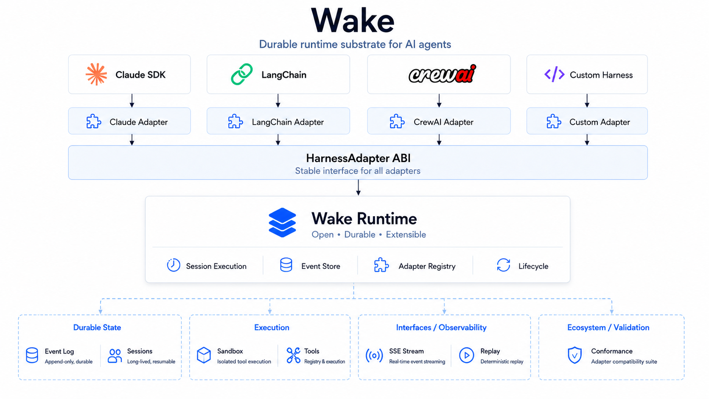

<p align="center">
  
</p>

<p align="center">
  <a href="LICENSE"></a>
  
  
  <a href="https://github.com/raphaelchristi/wake/releases/tag/v0.5.2-fixes"></a>
</p>

<p align="center">
  Bring your framework, your model, your tools. Wake handles event log, sandbox, vault and lifecycle.
</p>

---

## Why Wake?

If you run **one** AI agent app, you don't need Wake — `python main.py` is fine.

Wake matters when you have **multiple agent apps**, a **multi-tenant** product, or **compliance pressure** (audit, replay, data residency). At that point you start reimplementing the same plumbing in every app — and that plumbing is what Wake gives you for free.

### The 8 concrete things Wake adds

| | Without Wake (N apps standalone) | With Wake (shared substrate) |
|---|---|---|
| **Durability** | Container restarts → session lost | Event log persists; another worker resumes via advisory lock in <60s |
| **Replay** | Re-read LangSmith trace (if it didn't expire) | Deterministic step-by-step scrubber **including sandbox state** at any event |
| **Audit** | Cross-correlate logs from N apps + Phoenix + LangSmith | Single canonical event log; query by tenant/agent/time/cost |
| **Sandbox** | Tool calls run on the container host (injection risk) | `sandbox-runtime` (same library Anthropic uses internally) — agent can't escape |
| **Vault** | Each app reads secrets via middleware; tokens leak in logs if you slip | Agent never sees tokens; agentgateway substitutes placeholders at egress |
| **Multi-model** | Provider hardcoded per app; switching = code change + redeploy of N | LiteLLM at substrate; one config switch hits all agents |
| **Multi-worker** | Each app's own retry/backpressure; bug in one breaks all | Postgres advisory locks + heartbeat; kill-and-resume across a fleet |
| **Cost tracking** | Manual spreadsheet across N billing dashboards | LiteLLM callbacks → event metadata → unified dashboard |

Anthropic solved all of this internally with **Managed Agents** (proprietary, Claude-only, hosted). Wake is the open-source version — and goes further: **any** harness (LangGraph, CrewAI, Pydantic AI, Claude SDK, custom) plugs in via the `HarnessAdapter` ABI v0.1.0.

### When Wake is for you

Pick Wake when at least 3 of these are true:

- You run **3+ agent apps** (or plan to within 12 months)
- You need **multi-tenant isolation** (vault namespaces, per-tenant audit)
- Customers ask for **audit log / compliance** (SOC2, HIPAA, internal review)
- You want to **switch LLM providers** without rewriting every app
- You need **deterministic replay** for debugging or evals
- Tool calls touch sensitive data and **must be sandboxed**
- You operate **self-hosted** (data residency, air-gapped, on-prem)

### When Wake is **NOT** for you

Honest red flags — don't adopt Wake if:

- You have **one app** and `python main.py` works (you're adding ops cost for zero gain)
- **Hosted is fine** and Claude-only is fine → use Anthropic Managed Agents directly
- **No compliance / audit pressure** (no one will ever query your event log)
- **Small team (1–3 devs)** without bandwidth to operate Postgres + agentgateway + Infisical sidecars
- You need a **memory store / RAG / vector DB** at the substrate level — Wake doesn't have those yet
- You need **scheduled / always-on agents** — Wake's model is session-per-request

### The K8s analogy

Wake : agents :: Kubernetes : containers.

- 2 containers? Use `docker run`. K8s is overkill.
- 200 containers + 30 teams? Without K8s you suffer.
- Wake follows the same curve. Adopt when the substrate cost is **less** than the cost of reimplementing it in each app.

> **Status:** Wake is alpha (v0.5.2). Production-shaped components ship (Postgres, sandbox, vault, multi-worker, dashboard) but **multi-tenancy is not first-class yet** — see [`docs/ROADMAP.md`](./docs/ROADMAP.md) for the gap list.

## Quickstart

```bash
pip install wake-ai[all-adapters]
```

```python
from wake.runtime import Session
from wake_adapter_claude_sdk import ClaudeSDKAdapter

session = await Session.create(
    adapter=ClaudeSDKAdapter(model="claude-sonnet-4-6"),
    tools=["bash", "file_read", "file_write"],
)

async for event in session.run("Refactor src/auth.py to use async/await"):
    print(event.type, event.payload)
```

Swap `ClaudeSDKAdapter` for `LangGraphAdapter`, `CrewAIAdapter`, or `PydanticAIAdapter` — same substrate, same event log, same sandbox.

## Architecture

```
┌─────────────────────────────────────────────────────────────┐
│  Harness  (Claude SDK · LangGraph · CrewAI · Pydantic AI)   │
└──────────────────────────┬──────────────────────────────────┘
                           │ HarnessAdapter ABI v0.1.0
┌──────────────────────────▼──────────────────────────────────┐
│  Wake Runtime  — sessions, dispatcher, event stream         │
├─────────────────┬────────────────┬──────────────────────────┤
│  Event Store    │   Sandbox      │      Vault               │
│  Postgres/SQLite│   sandbox-rt   │      Infisical           │
│  LISTEN/NOTIFY  │   Docker       │      OAuth flows         │
│  partitioned    │   fallback     │      egress proxy        │
└─────────────────┴────────────────┴──────────────────────────┘
```

The seam is the **HarnessAdapter ABI** (locked v0.1.0). Specs in [`docs/`](./docs/).

## Adapters

| Adapter | Package | Conformance | Status |
|---|---|---:|---|
| Claude Agent SDK | `wake-adapter-claude-sdk` | 10/10 | stable |
| LangGraph | `wake-adapter-langgraph` | 10/10 | stable |
| CrewAI | `wake-adapter-crewai` | 10/10 | stable |
| Pydantic AI | `wake-adapter-pydantic-ai` | 10/10 | stable |

Write your own — see [`docs/WRITING-AN-ADAPTER.md`](./docs/WRITING-AN-ADAPTER.md).

## Production stack

Phase 4 ships the infra layer:

- **Postgres backend** — events partitioned by `HASH(session_id)`, LISTEN/NOTIFY, advisory locks, multi-worker heartbeat
- **sandbox-runtime** — Anthropic's npm sandbox wrapped in Python, with graceful Docker fallback
- **Infisical Vault** — OAuth flows (GitHub/Slack/Notion), egress proxy, prompt-injection protection
- **LiteLLM** — Anthropic / OpenAI / Ollama multi-provider, normalized to canonical Wake events
- **agentgateway** — MCP HTTP egress sidecar
- **Deploy** — Helm chart + Docker Compose + 5 deploy guides

```bash
docker compose -f deploy/docker-compose.yml up    # self-host stack
helm install wake deploy/helm/wake                # kubernetes
```

## Reuses, doesn't reinvent

| Layer | Component |
|---|---|
| OS sandbox | [`anthropic-experimental/sandbox-runtime`](https://github.com/anthropic-experimental/sandbox-runtime) |
| Vault + proxy | [`Infisical/agent-vault`](https://github.com/Infisical/agent-vault) |
| Model router | [`LiteLLM`](https://github.com/BerriAI/litellm) |
| MCP gateway | [`agentgateway`](https://github.com/agentgateway/agentgateway) (Linux Foundation) |
| Tool protocol | [Model Context Protocol](https://modelcontextprotocol.io/) |

Wake builds the **spec, the runtime, the adapters.** Everything else plugs in.

## Status

| Phase | Status |
|---|---|
| 0 — Design Lock | ✅ done |
| 1 — Skeleton (runtime + CLI + SQLite) | ✅ done |
| 2 — First Adapter (HarnessAdapter ABI + Claude SDK + conformance suite) | ✅ done |
| 3 — Spec Validation (LangGraph + CrewAI + Pydantic AI adapters, 10/10) | ✅ done |
| 4 — Production Stack (Postgres + sandbox-runtime + Vault + LiteLLM + deploy) | ✅ done |
| 5 — Operator UI (Next.js dashboard: sessions, replay, metrics, vault) | ✅ done |
| 5.1 / 5.2 — Adversarial review fixes (auth, OAuth state, worker locks) | ✅ done |
| 6 — Public Launch | ⚪ next |

See [`phases/`](./phases/) for detailed progress.

### Known gaps (honest)

Wake is **alpha**. These belong on the roadmap before "1.0":

- **No multi-tenancy** — single namespace; org/workspace concept missing
- **No RBAC** — API key = god mode
- **No backup runbook** — Postgres exists, `pgbackrest` not wired
- **No client SDKs** — `wake-py` / `wake-ts` not published
- **No `wake eval`** — adapter conformance is tested; agent evals are not
- **No memory / RAG / artifact primitives** — out of scope today
- **No published benchmarks** — load test code exists, never run + published

If any of these are blockers, factor them into your decision.

## Docs

Start with:

- [`docs/ARCHITECTURE.md`](./docs/ARCHITECTURE.md) — how Wake works technically
- [`docs/SPEC-HARNESS-ADAPTER.md`](./docs/SPEC-HARNESS-ADAPTER.md) — the ABI, locked v0.1.0
- [`docs/SPEC-EVENT-SCHEMA.md`](./docs/SPEC-EVENT-SCHEMA.md) — canonical event log, locked v0.1.0
- [`docs/WRITING-AN-ADAPTER.md`](./docs/WRITING-AN-ADAPTER.md) — port your framework

Full index in [`docs/README.md`](./docs/README.md).

## Contributing

RFC-driven. Open an issue tagged `rfc` for spec changes, `bug` for defects, `feature` for proposals. Templates in [`.github/ISSUE_TEMPLATE/`](./.github/ISSUE_TEMPLATE/). See [`CONTRIBUTING.md`](./CONTRIBUTING.md).

## License

Apache 2.0 — see [`LICENSE`](./LICENSE).
